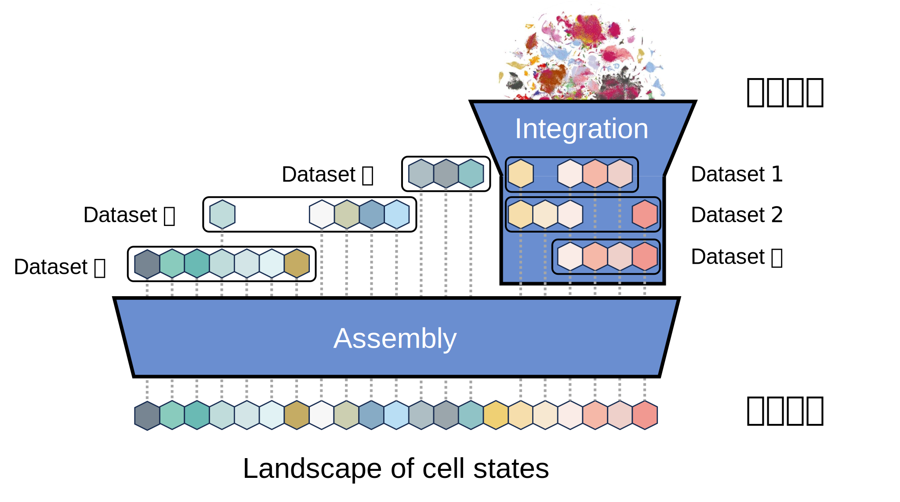
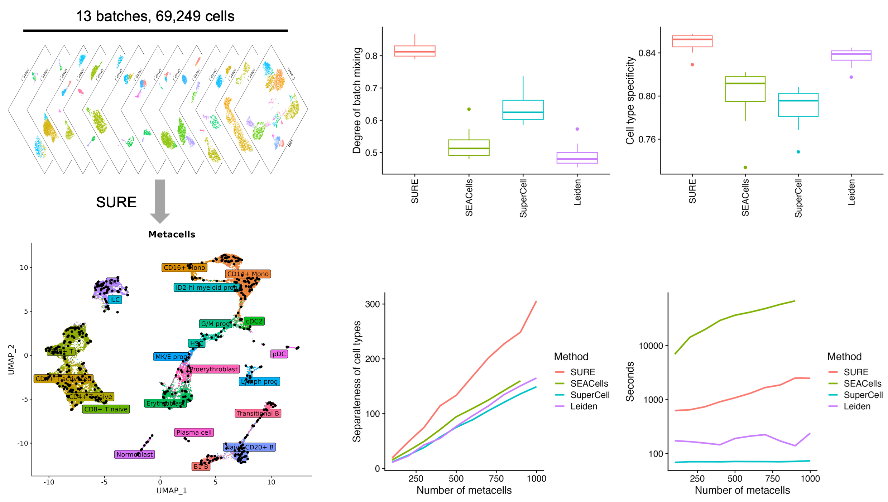
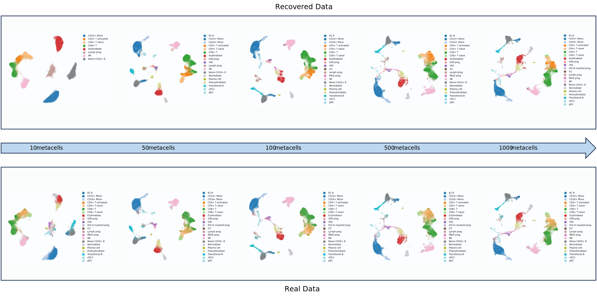

# Making cell atlas assembly simple, joyful, and useful!


# SUREv2
This provides an update of our previous tool [SURE (SUccinct REpresentation of cells)](https://github.com/ZengFLab/SURE).

SURE and SUREMO are metacell-centric generative models. They use vector quantization (VQ) codebook of metacells to represent cell distributions within 
**single-omics** and **multi-omics** datasets. SUREv2 provides broad utilities, including metacell calling, cell atlas compression, cell atlas assembly, reference mapping, reference-based positioning,
out-of-reference population detection, etc. 

SUREv2 is designed as a user-friendly package for cell atlas assembly and compression. 
- It provides a Python class **SingleOmicsAtlas** for the construction and application of compressed cell atlases. 
- It includes Python classes **SURE** and **SUREMO** for building metacell models from single omics data and single multi-omics data.
- It also offers the shell commands that users can call metacells within their data. 

**Features**
1. It finds metacells that precisely represent the distribution of cells within datasets.
2. It supports both single- and multi-omics datasets.
3. It provides distribution-based sampling methods.
4. It allows to construct an ultra-large-scale atlas, e.g. using over 10 million cells, with a single GPU card like RTX3090 and TITAN RTX.

## Installation
1. Download SUREv2 and enter the directory
```bash
git clone https://github.com/ZengFLab/SUREv2.git && cd SUREv2
```

2. Create a virtual environment
```bash
conda env create -f environment.yml
```

3. Activate the created environment. 
```bash
conda activate SURE
```

4. Install SUREv2
```bash
pip install .
```

5. Test whether SUREv2 has been installed
- Test the metacell command for single omics data
    ```bash
    SURE --help
    ```
- Test the metacell command for multi-omics data
    ```bash
    SUREMO --help
    ```

## Tutorials

### [Tutorial 1: Building a codebook of metacells from a single omics dataset](./Tutorial/tutorial_1/metacell_call_for_single_omics_dataset.ipynb)
> This tutorial demonstrate the usage of the SURE command.


### [Tutorial 2: Building a codebook of metacells from a multi-omics dataset](./Tutorial/tutorial_2/metacell_call_for_multi_omics_dataset.ipynb)
### [Tutorial 3: Distribution-preserved atlas compression](./Tutorial/tutorial_3/atlas_compression.ipynb)
> This tutorial gives an example of compressing an atlas into a codebook of 500 metacells.


### Tutorial 4: Identifying out-of-reference cell populations
### Tutorial 5: Simple reference-based sketching
### Tutorial 6: Distribution-based boosted sketching
### [Tutorial 7: Hierarchical cell atlas assembly](./Tutorial/tutorial_7/hierarchical_assembly.ipynb)
> This tutorial gives an example of building an assembled atlas using datasets from different species. 

### Tutorial 8: Sketching-based cell atlas integration
### Tutorial 9: Sketching-based cell atlas assembly
### Tutorial 10: Building a reference atlas for cell type annotation
### Tutorial 11: Drug response prediction
### Tutorial 12: Fitness landscape estimation
### [Tutorial 13: Calling metacells for scATAC-seq datasets](./Tutorial/tutorial_13/metacell_call_for_single_ATACseq_dataset.ipynb)

## Citations
- If you use **SURE** to call metacells for single omics datasets and assemble single-omics atlases, please kindly cite the work:
    
    >Feng Zeng and Jiahuai Han. Building a single cell transcriptome-based coordinate system for cell ID with SURE. bioRxiv (2024). [https://www.biorxiv.org/content/10.1101/2024.11.13.623403v1](https://www.biorxiv.org/content/10.1101/2024.11.13.623403v1)
    

- If you use **SUREMO** to call metacells for multi-omics datasets and assemble multi-omics atlases, please cite the following work:
    
    >Shuang-Rong Sun, Zhihan Cai, Feng Zeng. Self-organizing map of metacells and distribution-based boosted sketching for assembling atlas-level single-cell datasets. bioRxiv (2024). [https://www.biorxiv.org/content/10.1101/2024.11.16.622584v1](https://www.biorxiv.org/content/10.1101/2024.11.16.622584v1)
    

- If you use **SingleOmicsAtlas** to create compressed atlases and identify out-of-reference populations, please cite our work:
    
    >Zhihan Cai, Zhibin Hu, Shuang-Rong Sun, Zexu Wang, Fan Yang, Jiahuai Han, Feng Zeng. Distribution-preserved compression of single-cell atlases for privacy-protected data dissemination and novel cell type discovery. Submitted (2024).
    